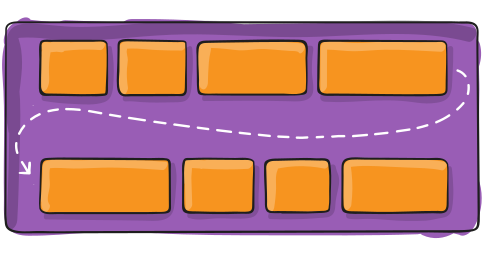
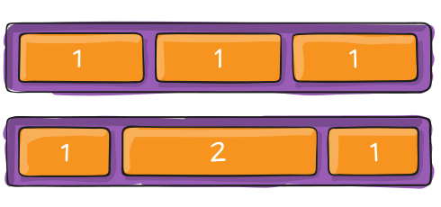
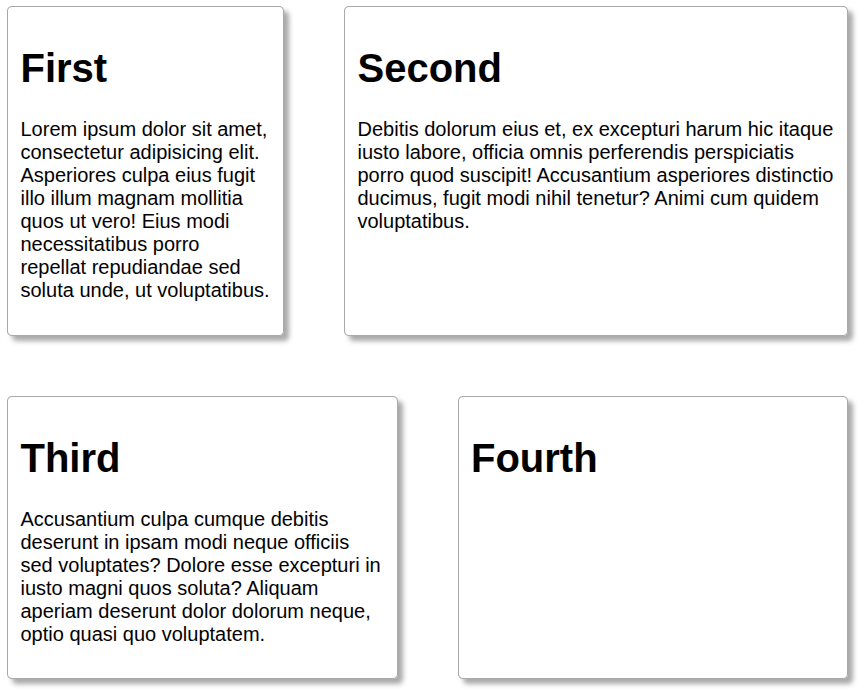
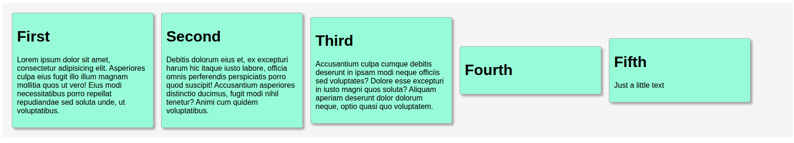
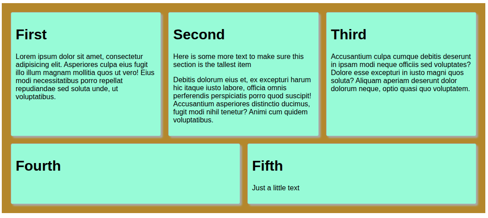

# Week 2 - HTML - Inleiding tot Flexbox

De Flexible Box Layout-module (meestal aangeduid als flexbox) is een eendimensionaal lay-outmodel voor het verdelen van ruimte
tussen elementen en biedt talrijke uitlijningsmogelijkheden. Dit artikel geeft een overzicht van de belangrijkste kenmerken van
flexbox, die we in de rest van deze handleidingen nader zullen bespreken.

Wanneer we flexbox omschrijven als eendimensionaal, bedoelen we dat flexbox de lay-out in één
dimensie tegelijk regelt — hetzij als een rij, hetzij als een kolom. Dit staat in contrast met het tweedimensionale model van CSS Grid
Layout, dat kolommen en rijen gezamenlijk regelt.

# Voorbeeld

In dit voorbeeld plaatsen we 4 vakken op de pagina met behulp van een `<section>`-element met een koptekst en wat tekst.

```php
<section>
    <header><h1>First</h1></header>
    <p>Lorem ipsum dolor sit amet, consectetur adipisicing elit. Asperiores culpa eius fugit illo illum magnam
        mollitia quos ut vero! Eius modi necessitatibus porro repellat repudiandae sed soluta unde, ut
        voluptatibus.
    </p>
</section>
```

Normaal gesproken worden `<section>`-elementen verticaal op een pagina geplaatst en beslaan ze de volledige breedte van de
pagina.

Door het `display:flex`-element te gebruiken (in plaats van het standaard `display:block`-element) kunnen we veel dingen aanpassen:

* de richting: verticaal (`column`) of horizontaal (`row`)
* normale of omgekeerde richting (`column-reverse` of `row-reverse`)
* hoe items binnen hun bovenliggende element worden geplaatst:
    * 'normale'-as
    * 'andere'-as
* spatiëring
    * `space-round`
    * `space-between`
    * `space-evenly`
* centrering

Zie de referenties aan het einde van dit artikel voor meer informatie.

Wat heel **belangrijk** is om te begrijpen, is dat het werken met flexbox vereist dat de juiste eigenschappen worden ingesteld in zowel het
**bovenliggende element** als de **onderliggende elementen**.

In dit voorbeeld gebruiken we de onderstaande CSS. Uitleg onder het voorbeeld

```css
main {
    font-family: sans-serif;

    article {
        display: flex;
        flex-direction: row; /* also try row-reverse*/
        flex-wrap: wrap;

        justify-content: space-between;

        column-gap: 3rem;
        row-gap: 3rem;

        section {
            flex-basis: 15%;

            min-width: 300px;

            border: 1px solid darkgray;
            border-radius: 4px;
            padding: 10px;
            box-shadow: 4px 4px 4px darkgray;
        }
    }
}
```

## Ouder- en kindelementen instellen met Flexbox

We gebruiken *geneste CSS* om de structuur van onze HTML te volgen. De `<article>` is de container van de sectie. We noemen deze daarom
de **ouder**. We willen de `<article>` als ouder gebruiken om de display-eigenschap van de onderliggende elementen in te stellen. In
dit geval gebruiken we _flexbox_ en stellen we `display` in op de waarde van `flex`.

We willen dat de `<section>`-elementen achter elkaar in een rij worden geplaatst en dat ze worden omgebroken als er onvoldoende ruimte is.

* stel `flex-direction` in op `row`. Hierdoor worden de directe kinderen in een rij geplaatst
* stel `flex-wrap` in op `wrap`, zodat items die niet passen op de volgende rij worden geplaatst.

## De CSS-eigenschappen van de onderliggende elementen instellen

Nu moeten we eerst naar de onderliggende elementen kijken: de `<section>`-elementen. Om ervoor te zorgen dat ze zich op de gewenste manier gedragen,
moeten we twee belangrijke eigenschappen instellen:

1. stel `flex-basis` in op een waarde; in dit geval hebben we gekozen voor 15% (van de beschikbare breedte van het bovenliggende element)
2. stel een minimale breedte van 300px in: `min-width:300px`.

De eerste eigenschap zorgt ervoor dat elk `<section>`-element 15% van de beschikbare ruimte inneemt. Hierdoor zullen
de
`<section>`-elementen steeds kleiner worden, mogelijk tot onder een breedte die als acceptabel wordt beschouwd. Daarom voegen we nog een eigenschap toe, `min-width`, en
geven we aan dat ‘ongeacht de beschikbare ruimte dit element niet kleiner mag worden dan 300 pixels’.

## Regelsplitsing

Dit leidt mogelijk tot een conflict met de `display:flex` en `flex-direction: row`. Want als alle onderliggende elementen
minstens 300px breed moeten zijn, passen ze mogelijk niet meer in één rij. Hier komt de `flex-wrap` om de hoek kijken: als de onderliggende elementen
niet meer in het bovenliggende element passen, bepaalt deze optie wat er moet gebeuren. In dit geval geven we de instructie om elementen die niet meer passen
in een volgende rij te plaatsen. Dit wordt **wrapping** genoemd.



(afbeelding van https://css-tricks.com/snippets/css/a-guide-to-flexbox/)

## Probeer het eens uit

Om dit voorbeeld beter te begrijpen, pas je de eigenschappen van

### `section`

Bekijk nu het tweede [voorbeeld](./index2.html). Let op de onderstaande CSS

```css
section {
    flex-basis: 10%;
    min-width: 200px;
    flex-grow: 1;

    ...
}
```



(afbeelding van https://css-tricks.com/snippets/css/a-guide-to-flexbox/)

Pas nu de grootte van je browservenster aan totdat er slechts één `<section>` op de rij past. Let op hoe de `<section>` zich over de
volledige breedte van de beschikbare ruimte uitstrekt. Dit komt door de eigenschap `flex-grow:1`: hierdoor kunnen elementen in grootte toenemen
zodat alle elementen dezelfde grootte krijgen. Je kunt de waarde voor elk onderliggend element aanpassen.

Bekijk [voorbeeld 3](./index3.html). 

De CSS gebruikt nu een andere `flex-grow`-instelling (3) voor de tweede
`<section>`. Dit wordt aangegeven met de `&:nth-child(2)`, die hetzelfde is als `section:nth-child(2)`.

```css
  section {
    flex-basis: 10%;
    min-width: 200px;
    flex-grow: 1;

    &:nth-child(2) {
        flex-grow: 3;
    }

    ...
}

```

Let op: deze `flex-grow` geldt alleen voor items **op dezelfde regel**! Probeer dus nogmaals het formaat van je browservenster aan te passen om
twee `<section>`-elementen per regel weer te geven.



# Ruimte beheren

Je kunt bepalen hoe de ruimte door onderliggende elementen wordt ingenomen. Hierbij komt wat terminologie kijken die we eerst moeten begrijpen. Ruimte
kan horizontaal (_width_) en verticaal (_height_) worden bekeken. Dit geldt echter alleen wanneer we `display:block` gebruiken.
Bij gebruik van `display:flex`
kunnen we de richting wijzigen waarin items worden weergegeven.

Daarom moeten we het gebruik van ‘horizontaal’ en ‘verticaal’ herzien. Bij het gebruik van flexbox hanteren we de termen ‘**hoofdas**’ en
de ‘**dwarsas**’. De ‘hoofdas’ is de as die we hebben gedefinieerd met `flex-direction`. Wanneer we `row` toewijzen als
richting, is de ‘hoofdas’ horizontaal en is de `cross axis` verticaal.

Waarom is dit belangrijk? Omdat we, wanneer we de browser instrueren hoe de ruimte moet worden ingevuld, aparte instructies hebben
voor de ‘hoofdas’ en de ‘dwarsas’. Hun gedrag hangt dus af van hoe de assen zijn gedefinieerd.

Voor het beheren van het ruimtegebruik op de ‘hoofdas’ hebben we de instructie `justify-content`. Voor het beheren van het ruimtegebruik op de ‘dwarsas’
hebben we de instructie `align-items`.

| Flex-richting | Hoofdas  | Dwarsas | horizontale ruimte beheren | verticale ruimte beheren |
|----------------|------------|------------|-------------------------|-----------------------|
| rij | Horizontaal | Verticaal   | justify-content | align-items | 
| kolom | Verticaal   | Horizontaal | align-items | justify-content | 

We kunnen nu de CSS-eigenschappen van het bovenliggende element `<article>` enigszins aanpassen. Zie [voorbeeld4](./index4.html). 

```css
article {
    display: flex;
    flex-direction: row; /* also try row-reverse*/
    flex-wrap: wrap;

    justify-content: flex-start;
    align-items: center;

    ....
}
```

Merk op dat we `align-items` hebben toegevoegd met een waarde van `center`. We hebben de `<section>` teruggezet naar de onderstaande waarden; ververs je
scherm.

```css
section {
    flex-basis: 15%;
    min-width: 300px;
}
```

Merk op dat

1. Het hoogste item de hoogte van de `<article>` bepaalt (weergegeven in de kleur `whitesmoke`). De onderliggende elementen die
   minder hoog zijn (derde, vierde, vijfde) worden gecentreerd in plaats van bovenaan geplaatst.
2. De `<section>`-elementen hebben verschillende hoogtes.



## Items uitlijnen: stretch

Misschien willen we dat de elementen over de verticale ruimte worden uitgerekt. In dit geval kunnen we de `align-items: stretch` gebruiken.
Dit bepaalt het ruimtegebruik in de ‘dwarsas’ en vult alle beschikbare ruimte op. Bekijk
[voorbeeld 5](./index5.html). 

Bekijk de CSS (niet-relevante delen zijn uit het onderstaande voorbeeld verwijderd).

```css
    article {

    display: flex;
    flex-direction: row;
    flex-wrap: wrap;

    justify-content: space-between;
    align-items: stretch;

    section {
        flex-basis: 15%;
        min-width: 300px;
        flex-grow: 1;
    }
}
```

Let er nogmaals op dat deze regels alleen van toepassing zijn op items **in dezelfde rij**. Dit kan tot ongewenst gedrag leiden wanneer er een
tweede rij wordt aangemaakt:



Dit probleem is echter niet eenvoudig op te lossen met behulp van flexbox-instructies. Je zou de hoogte van de items kunnen instellen met
`height:300px`, maar dat gaat enigszins in tegen het doel van flexbox.

# Conclusies

Daarom stellen we:

> Flexbox is ontworpen als een **eendimensionale** lay-outengine: ofwel horizontaal (rij) ofwel verticaal (kolom). Elke aangemaakte rij
> of kolom wordt gezien als een nieuwe, autonome entiteit die geen kennis heeft van eerdere rijen of kolommen.

Als dit geen probleem is, is flexbox wellicht geschikt voor jou. Anders kun je misschien beter de `display:grid`
methode gebruiken.

# Referenties

* [Een complete handleiding voor CSS-flexbox-lay-outs](https://css-tricks.com/snippets/css/a-guide-to-flexbox/)
* [MDN: Basisbegrippen van flexbox](https://developer.mozilla.org/en-US/docs/Web/CSS/Guides/Flexible_box_layout/Basic_concepts)
