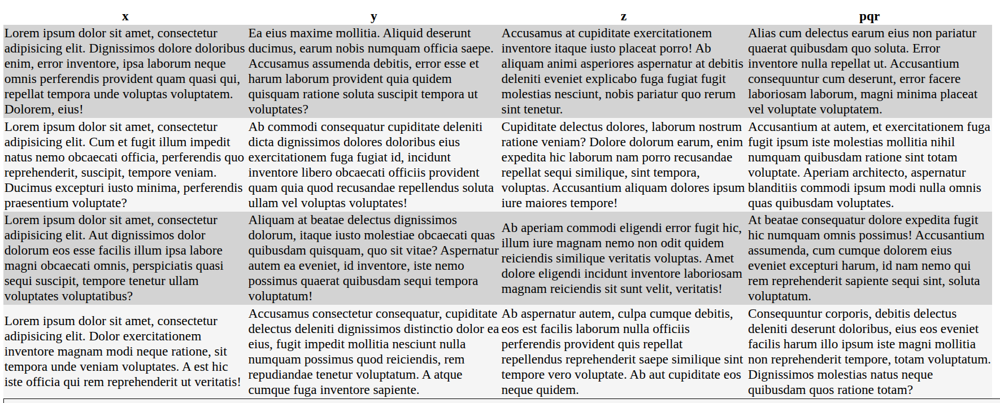

# Week 3 -  HTML - Pseudoklassen gebruiken

CSS maakt gebruik van ‘selectors’ om HTML te koppelen aan CSS-instructies

Voorbeelden

* `p` = elk <p>-element, waar dan ook
* `div.header` = het element <div> met de klasse ‘header’
* `section p` = een <p>-element, waar dan ook, binnen een `<section>`
* `section > p` = een <p>-element als direct onderliggend element van een `<section>`
* `button + button` = wanneer `<button>` een broer of zus heeft  `<button>`

voorbeelden:

```html
<p>.....</p>

<div class="header">....</div>

<section>
    <p>.....</p>
    <div>
        <div>
            <p>.....</p>
        </div>
    </div>
</section>

<section>
    <p>.........</p>
</section>

<div>
    <button>save</button>
    <button>cancel</button>
</div>
```

Soms heb je meer nodig

* "Pas alleen de opmaak toe op het tweede `<P>`-element"
* "Pas alleen opmaak toe op elke 'even' `<tr>` (regel) in een `<table>` om zebrastrepen te creëren"
* "Pas alleen opmaak toe wanneer de muis boven een `<div>` zweeft"

Bekijk de voorbeeld-HTML-code eens. Deze is hier ter wille van de beknoptheid ingekort.

```html

<article>
    <section>
        <header>
            <h1>Hovering</h1>
        </header>
        <p>Lorem ipsum dolor sit amet, consectetur adipisicing elit. Alias aliquam aliquid aspernatur atque aut,
            dignissimos exercitationem id incidunt laudantium maiores molestiae neque non, odio optio placeat
            provident, quidem quis similique.</p>
    </section>
    <section>
        <header>
            <h1>Striped table</h1>
        </header>
        <table>
            <tr>
                <td>....</td>
                <td>....</td>
                <td>....</td>
                <td>....</td>
            </tr>
        </table>
    </section>
    <section>
        <header>
            <h1>Weird transformation</h1>
        </header>
        <p>Just some text. Hover me!</p>
    </section>
</article>
```

## Eerste van het type en bij aanwijzen

De CSS voor de eerste sectie:

```css
    section:first-of-type {
    width: 30em;
    border: 1px solid black;

    p:hover {
        background-color: darkgray;
        color: white;
        cursor: pointer;
    }
}
```

Let op de pseudoklasse `:first-of-type`. MDN zegt over deze pseudoklasse:
> De CSS-pseudoklasse :first-of-type vertegenwoordigt het eerste element van zijn type (tagnaam) binnen een groep van
> gelijke elementen

In ons geval stelt dit ons in staat om de eerste sectie binnen de `<article>` te selecteren zonder dat we een klasse hoeven toe te voegen aan de
`<section>`.

Let ook op de pseudoklasse `:hover`. Nogmaals de definitie van MDN:
> De CSS-pseudoklasse :hover komt overeen met een element wanneer een gebruiker ermee interageert met behulp van een aanwijsapparaat. De pseudoklasse
> wordt doorgaans geactiveerd wanneer de gebruiker de cursor (muisaanwijzer) over een element beweegt zonder de muisknop
> in te drukken.

Hiermee kunnen we een `<p>`-element markeren. In dit geval doen we drie dingen:

1. de achtergrondkleur wordt gewijzigd in `darkgray`
2. de tekstkleur wordt gewijzigd in wit om de tekst beter leesbaar te maken
3. we veranderen de muisaanwijzer in een `pointer`. De ‘pointer’ is de cursor die je normaal gesproken ziet wanneer je met de muis boven een
   link zweeft.

## Gestreepte rijen in een tabel

De CSS voor de gestreepte tabel wordt hieronder weergegeven (in de echte CSS zitten nog een paar extra opmaakopties, neem eens een kijkje!).

```css
section:nth-of-type(2) {

    table {
        font-size: 10pt;
        border-collapse: collapse;

        tr td {
            background-color: whitesmoke;
        }

        tr:nth-child(odd) td {
            background-color: lightgray;
        }
    }
}
```

Let nogmaals op de `:nth-of-type(2)`. Dit betekent 
> "zoek naar meerdere `<section>`-elementen die op hetzelfde niveau staan en kies het tweede".

In ons geval selecteert dit dus het tweede gedeelte met de `<table>`.

We stellen de `font-size` in op `10pt` en laten de randen samensmelten. Door de randen te laten samensmelten, wordt de ruimte tussen rijen en
kolommen verwijderd. 

Vervolgens stellen we de achtergrondkleur in op `whitesmoke` voor elke `<td>` die deel uitmaakt van een rij (`<tr>`). 

De volgende instructie `tr:nth-child(odd) td` betekent:
> „zoek naar elke tabelrij, maar selecteer alleen de rijnummers die oneven zijn (1, 3, 5, 7, 9, ...) en pas vervolgens de opmaak toe op de `<td>`-elementen
> die in die rij zijn opgenomen“

Hiermee kunnen we de eerste, derde, vijfde (enzovoort) rij een andere kleur geven, waardoor een gestreepte tabel ontstaat (of 
zebra-strepen). Dit wordt vaak gebruikt in plaats van een rand rond alle elementen te plaatsen. Zie de afbeelding hieronder voor het effect.



## Pseudo-klassen nesten

Bij het gebruik van geneste CSS kun je in een situatie terechtkomen waarin je een pseudo-klasse moet toevoegen aan het bereik waarin je je op dat moment
bevindt. In het derde gedeelte is dit het geval. We gebruiken eerst de pseudoklasse `:last-of-type` om de laatste paragraaf
in onze HTML te selecteren en de elementen `border` en `background-color` op te maken.


```css
article {
    section:last-of-type {
        border: 1px solid black;
        background-color: whitesmoke;

        &:hover {
            p {
                background-color: #005aa7;
            }
        }
    }
}
```


Maar we willen ook een `:hover`-effect kunnen toepassen op **alleen diezelfde sectie**. In plaats van een geheel nieuwe scope te openen,
kunnen we het `&`-teken gebruiken. Dit betekent:

> Combineer alle selectors en pseudoklassen die ‘boven mij’ al zijn gedefinieerd.

In dit geval is de `&` dus gelijk aan `article section:last-of-type`. 

Let op: er staat *geen spatie* tussen de `&` en de `:hover` pseudoklasse. Dit is een belangrijke vereiste. Anders
zou je dit krijgen:

```css
article section:last-of-type :hover {
   ....
}
```

En dat is iets anders! Dit betekent nu: 
> selecteer een artikel en de laatste sectie daarbinnen. Pas vervolgens styling toe op **elk element waar de muis over dat
> element beweegt.

Maar we hebben nodig:
> selecteer een artikel en de laatste sectie daarbinnen. Pas vervolgens styling toe op die sectie als de muis eroverheen beweegt
> .

Daarom moeten we de spatie verwijderen. Dit laat ook zien dat het toegestaan is om meerdere pseudoklassen te gebruiken. 

```css
article section:last-of-type:hover {
   ....
}
```

We begrijpen nu dus dat de vorige CSS precies hetzelfde is als

```css

article section:last-of-type {
   border: 1px solid black;
   background-color: whitesmoke;
}

article  section:last-of-type:hover p {
   background-color: #005aa7;
}
```

Merk op dat ik in de echte HTML en CSS ter illustratie ook een animatie heb toegepast. De bovenstaande CSS staat ook
in het CSS-bestand, maar is omgeven door opmerkingen (/** .... */). 