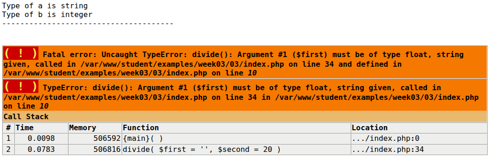

# Week 4 - PHP - Typeconversie 1

In dit voorbeeld worden enkele voorbeelden van typeconversie getoond.

# De delingsfunctie

Bekijk dit voorbeeld met een PHP-functie eens.

```php
function divide(float $first, float $second): float|null
    if ($second == 0) {
        return null;
    }
    return $first / $second;
}

```

## Geen conversie

Wanneer deze functie wordt aangeroepen met variabelen van verschillende typen, is de typeconversie waarneembaar. Bijvoorbeeld

```php

$a = 10.3;
$b = 20;
$c = divide($a, $b);
```

Dit werkt perfect en levert `0.515` op. De variabele $a is al een `float` omdat deze een `.` bevat om aan te geven dat het om een
drijvende-kommagetal gaat.

## Typeomzetting van string naar float

Het onderstaande voorbeeld levert `0.5` op. De **string**-waarde van $a is "10", maar wordt eerst omgezet naar een float en vervolgens wordt de
functie uitgevoerd. Dus ook al ontbreekt de `.`, zal PHP een `float` aanmaken in plaats van een `int`, omdat de
functie `divide` `float` parameters „wil”.

```php

$a = "10";
$b = 20;
$c = divide($a, $b);
```

## Typeconversie van een tekenreeks met een float-waarde naar een float

In het onderstaande voorbeeld bevat de variabele $a de tekenreeks "10.3". Dit kan via typeconversie worden omgezet naar een float-waarde van 10.3.
Let op: in verschillende landen kan het _drijvende-kommateken_ verschillen. In de meeste landen is dit de punt (`.`), maar
in Nederland is het een komma (`,`). Dit werkt dus perfect en levert `0.515` op.

```php

$a = "10.3";
$b = 20;
$c = divide($a, $b);
```

## Typeomzetting van lege tekenreeks naar float

In het volgende voorbeeld is de waarde van $a de lege tekenreeks (`""`). PHP kan dit nu niet omzetten naar een float, dus wordt er een foutmelding
gegenereerd.

```php

$a = "";
$b = 20;
$c = divide($a, $b);
```



# Referenties

* [PHP Type juggling](https://www.php.net/manual/en/language.types.type-juggling.php)