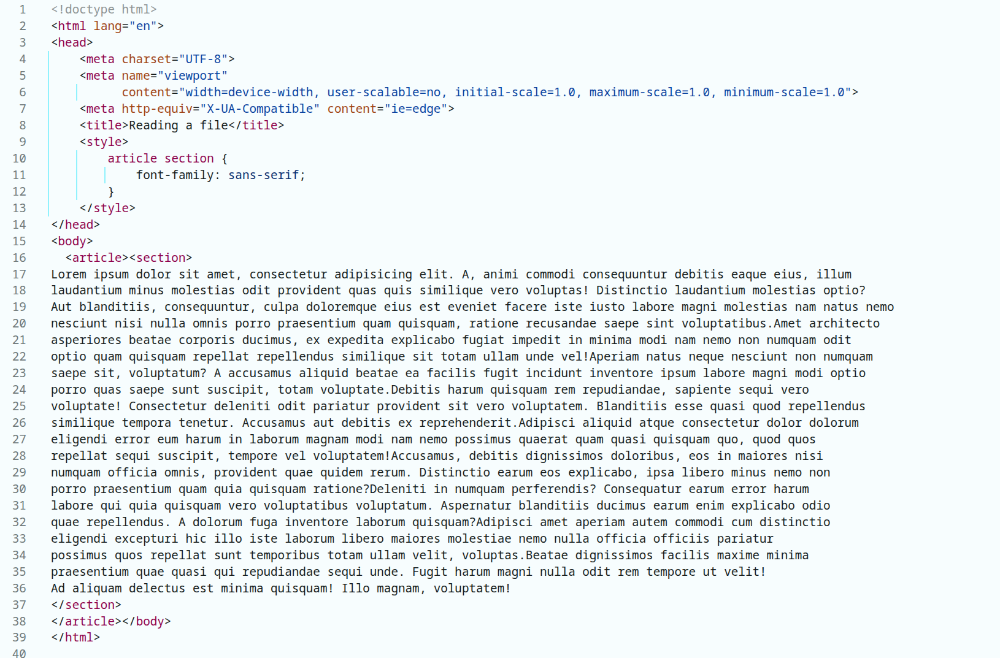

# Week 4 - PHP - PHP Standard functions: Reading a file

In PHP it is easy to read or write from a file. This can be usefull to process data files or include HTML.

In the example below a file named 'information.txt' in the current folder ( `./` ) is read entirely in the variable $information.

```php
  $information = file_get_contents('./information.txt');
```

You can use the information read from files to integrate into your HTML as show in this example:

```php
<body>
  <?= $information ?>
</body>
```

Looking a the text-file, there actually is some HTML present.

```html
<article>
    <section>
        Lorem ipsum ............
    </section>
</article>
```

So, when echoing the contents from the `information.txt` we can also integrate this HTML neatly in our HTML page.
The browser will apply styling present in the `<head>` to the whole page. Remember that for the browser there is just
HTML coming from the webserver (see the screendump from the browser below). The browser does not know how you create
all the HTML.

Notice that the standard instruction `include_once()` also includes a PHP or HTML file at the place where this command
is executed!



# References

* [PHP include_once](https://www.php.net/manual/en/function.include-once.php)
