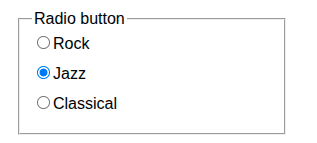
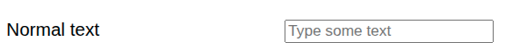

# Week 5 - HTML - Formulieren

Formulieren zijn bedoeld om informatie van de browser naar de server te verzenden.

De gebruiker vult een formulier in en verzendt de informatie naar de server voor verwerking. De server stelt vervolgens een antwoord samen
met behulp van een HTTP-statuscode en resultaten zoals HTML, CSS, afbeeldingen, ...

In PHP wordt de informatie bij gebruik van de `method="post"` verzameld in een `super global`-variabele met de naam `$_POST`. Dit is
een associatieve array die kan worden gebruikt voor validatie en verdere verwerking.

## Het basisformulier

Het meest eenvoudige formulier is een leeg formulier, zonder invoervelden. Een `<form>` heeft een

```html

<form action="process.php" method="post">
</form> 
``` nodig

# Labels gebruiken

Een label wordt gebruikt om de gebruiker aan te geven wat er in het betreffende `input` moet worden ingevoerd. Maar het helpt ook bij het gemakkelijker selecteren
van het betreffende invoerveld: door op een label te klikken kan de gebruiker direct beginnen met het invoeren van tekst.

Om een `<label>` te koppelen aan een `<input>` (of een ander type formulierbesturingselement) moet u verwijzen naar het `id`-attribuut in het
`<label>`, zoals hieronder weergegeven.

```html
<label for="field01">Normal text</label>
<input name="field01" id="field01">
```

# Tekstinvoer

## Normale tekst

Als je wilt dat de gebruiker ‘gewoon normale tekst’ invoert, kun je het attribuut `type="text"` toevoegen. Dit is ook de standaardinstelling.

Het attribuut `placeholder` geeft een hint over welke tekst moet worden ingevoerd. In combinatie met het attribuut `<label>` helpt dit de
gebruiker te begrijpen wat geldige tekst is.

In dit voorbeeld geeft het attribuut `size` aan dat de breedte op het scherm 20 tekens is. De attributen `minlength` en
`maxlength` geven de minimaal en maximaal toegestane tekstlengte aan.

```html

<input type="text"
       placeholder="Type some text"
       required
       size="20"
       minlength="1" maxlength="10"
       name="field01" id="field01"><br>
```

## Een e-mailadres

```html    
<label for="field02">E-mail address</label>
<input type="email" name="field02" id="field02">

```

## Telefoonnummer

```html
<label for="field03">Telephone number</label>
<input type="tel"
       placeholder="Enter a valid phonenumber"
       name="field03"
       id="field03"><br>
```

## Een datum, zonder tijd

```html
<label for="field04">Date</label>
<input type="date"
       min="2026-01-01"
       max="2026-12-31"
       name="field04" id="field04"><br>
```

## Een jaar en maand

```html
<label for="field05">Month</label>
<input type="month"
       required
       min="2026-01-01"
       max="2026-12-31"
       name="field05" id="field05"><br>
```

## Een week in een jaar

```html
<label for="field06">Week</label>
<input type="week"
       min="2026-01-01"
       max="2026-12-31"
       name="field06" id="field06"><br>
```

## Tijd

```html
<label for="field07">Time</label>
<input type="time"
       min="08:00"
       max="18:00"
       name="field07" id="field07"><br>
```

## Een getal binnen een bereik met behulp van een schuifbalk

Als het exacte getal dat de gebruiker invoert niet echt belangrijk is, kan een schuifregelaar voor een bereik handig zijn. De schuifregelaar wordt
weergegeven als een voortgangsbalk met een knop om de waarde aan te passen. Zie de afbeelding hieronder.


In het onderstaande voorbeeld stellen we een toegestaan bereik in met behulp van de attributen `min` en `max`. Het attribuut `step` zorgt ervoor dat de
waarde alleen met de opgegeven waarde (in dit geval 10) kan worden verhoogd of verlaagd. Dit zorgt er ook voor dat de waarde
een veelvoud van tien moet zijn!  Omdat de minimumwaarde nul (0) is, zijn alleen waarden als 0, 10, 20, 30 enzovoort toegestaan.

```html
<label for="field08">Range</label>
<input type="range"
       min="0"
       max="100"
       step="10"
       name="field08" id="field08"><br>
```

Het nadeel is dat de gebruiker geen feedback krijgt over de exacte waarde!

## Een gewoon getal

```html
<label for="field09">Number</label>
<input type="number"
       min="0"
       max="100"
       step="5"
       name="field09" id="field09"><br>
```

## Een selectievakje

Met het selectievakje kan de gebruiker een optie in- of uitschakelen.

```html
<label for="field10">Checkbox</label>
<input type="checkbox"
       checked
       name="field10" id="field10"><br>
```

Let op: alleen als de gebruiker het vakje aanvinkt, stuurt de browser deze informatie naar de server. Als het
selectievakje ‘niet is aangevinkt’, ontbreekt de volledige invoer in de `$_POST` in PHP.

Als het selectievakje is aangevinkt, ontvangt de server het met de waarde ‘on’:

```text
  'field10' => string 'on' (length=2)
```

Wanneer de gebruiker het vakje niet heeft aangevinkt, ontbreekt de waarde ervan (let op het ontbrekende veld 10):

```text
/var/www/student/examples/week05/01/process.php:3:
array (size=14)
  'field01' => string 'wfwfe' (length=5)
  'field02' => string '3234@hefnef' (length=11)
  'field03' => string '8394828934' (length=10)
  'field04' => string '2026-07-29' (length=10)
  'field05' => string '2026-08' (length=7)
  'field06' => string '2026-W27' (length=8)
  'field07' => string '13:35' (length=5)
  'field08' => string '60' (length=2)
  'field09' => string '30' (length=2)
  'field11' => string 'J' (length=1)
  'field12' => string 'AEKOKFOEKF' (length=10)
  'field13' => string 'wfwfewefwefwef' (length=14)
  'field14' => string 'J' (length=1)
  'submitbutton' => string 'Verzenden' (length=9)
```

## Keuzerondje om tussen opties te kiezen

Met keuzerondjes kan de gebruiker kiezen uit een vaste reeks opties. Dit is een iets andere opzet, omdat we nu
meerdere invoervelden met dezelfde naam nodig hebben. Om deze `<input>`-elementen te ordenen, gebruiken we een `<fieldset>`. De `<fieldset>` is
een element dat een kader rond HTML-elementen tekent, met de mogelijkheid om een bijschrift toe te voegen (`<legend>`). Zie de
afbeelding hieronder.



Merk op dat wanneer een gebruiker een van de gegeven opties selecteert, alleen die `<input>`-waarde naar de server wordt verzonden.

```html

<fieldset>
    <legend>Radio button</legend>
    <label><input type="radio" id="field11a" name="field11" value="R">Rock</label><br>
    <label><input type="radio" id="field11b" name="field11" value="J" checked>Jazz</label><br>
    <label><input type="radio" id="field11c" name="field11" value="C">Classical</label><br>
</fieldset>
```

## Een invoerveld dat aan een patroon moet voldoen

Soms wil je misschien afdwingen dat de ingevoerde waarde aan een bepaald patroon voldoet. Deze patronen kunnen worden gespecificeerd
met behulp van een (complexe) taal die ‘reguliere expressies’ wordt genoemd. Zie de onderstaande referenties voor meer informatie of boeken.

Let op: de browser geeft alleen een algemene foutmelding wanneer de invoer niet aan het patroon voldoet.

```html
<label for="field12">Pattern</label>
<input type="text" name="field12" id="field12"
       pattern="[A-Z]+"
       size="30"
       required
       placeholder="Type only capital characters"><br>
```

## Wachtwoorden

Bij het invoeren van wachtwoorden is het wellicht niet wenselijk dat andere gebruikers (die naar je scherm kijken) het wachtwoord kunnen lezen.
Daarom is er een invoertype ‘password’. Dit maskeert de daadwerkelijk getypte tekens (bijvoorbeeld met sterretjes of
stipjes).

Je kunt een `pattern="...."`-attribuut toevoegen om de complexiteit van het wachtwoord te valideren met behulp van een reguliere expressie. In
dit geval geven we de browser aan dat het wachtwoord minimaal 4 tekens en maximaal 42 tekens lang mag zijn.

```html
    <label for="field13">Password</label>
<input type="password" name="field13" id="field13" minlength="4" maxlength="42"><br>

```

## Een optie uit een lijst selecteren met een dropdown

```html
<label for="field14">Dropdown</label>
<select name="field14" id="field14">
    <option value="">-None-</option>
    <option value="J">Jazz</option>
    <option value="R">Rock</option>
    <option value="C">Classical</option>
</select>
```

# De gegevens verzenden

Om de browser te laten weten dat de gebruikersinvoer naar de server moet worden verzonden, moet je een **submit**-knop toevoegen. Dit kan een
`<input>` met `type="submit"` zijn of een gewone `<button>`.

```html
    <input type="submit" name="submitbutton"><br>
</form>

```

## Een formulier opmaken

Er zijn verschillende manieren om een formulier op te maken

* met behulp van een raster
* met behulp van flex-box
* gebruik display:inline-block voor labels om er een breedte aan te kunnen toekennen.
* pas styling toe wanneer de invoer ongeldig is
* pas styling toe wanneer een invoerveld _de focus heeft_ (de gebruiker kan tekst invoeren)

Afhankelijk van je keuze voor de opmaak moet de HTML mogelijk enigszins worden aangepast. In dit voorbeeld heb ik laten zien hoe je eenvoudig
de invoervelden links kunt uitlijnen door de `<label>`-elementen een vaste breedte te geven.

Bekijk het onderstaande voorbeeld eens. We zullen elk onderdeel afzonderlijk bespreken.

```css
body {
    font-family: sans-serif;
}

label {
    display: inline-block;
    width: 15em;
    margin-bottom: 10px;
}

fieldset {
    width: fit-content;
}

input {
    padding: 4px;

    &:user-invalid {
        border: 2px solid red;
    }
}

input:focus {
    border: 2px solid black;
}
```

Eerst wijzen we een beter lettertype toe aan de hele pagina met behulp van een `body`-selector.

```css
body {
    font-family: sans-serif;
}
```

Door gebruik te maken van de `display:inline-block` wordt de `<label>` een "block"-element dat een vaste breedte kan hebben. In dit geval
wordt de breedte gemeten in `em`-eenheden. Het teken 'm' is het breedste teken; een 'm-streepje' is een streepje (lijn) met
dezelfde breedte als het teken 'm'. Merk op dat dit korter is dan het minteken. Dus `15em` betekent _'zo breed alsof er 15
'm'-tekens zouden worden gebruikt'_.

Dit is handig als je weet dat al je labels binnen 15 tekens passen.

```css
label {
    display: inline-block;
    width: 15em;
    margin-bottom: 10px;
}
```

Het `<fieldset>` is een element dat een kader rond HTML-elementen tekent, met de mogelijkheid om een bijschrift toe te voegen.

```css
fieldset {
    width: fit-content;
    margin: 10px;
}
```

Dit element beslaat normaal gesproken de volledige breedte van de pagina. Door `width: fit-content` te gebruiken, geef je de browser de opdracht om
eerst de onderliggende elementen weer te geven en vervolgens te bepalen hoe breed het breedste onderliggende element is. Dit bepaalt de breedte van het
`<fieldset>`

## Dynamische opmaak op basis van gebruikersgedrag

Wanneer de gebruiker door het formulier navigeert, kunnen we CSS-instructies gebruiken om de gebruikersinteractie te verbeteren. Bekijk de onderstaande CSS eens.

```css
input {
    padding: 4px;
}

input:user-invalid {
    border: 2px solid red;
}

input:focus {
    border: 2px solid black;
}
```

Eerst zorgen we ervoor dat het invoerveld wat meer ruimte binnen het kader krijgt met behulp van de instructie `padding:4px`. Bekijk het
verschil hieronder:

Eerst zonder de extra opvulling.



Vervolgens de versie met iets meer opvulling (4px).


Met `pseudo-selector` `:user-invalid` kunnen we een invoerveld opmaken wanneer de gebruiker ongeldige tekst heeft ingevoerd (zie
de referenties hieronder voor meer informatie).

Met de `pseude-selector` `:focus` kunnen we een invoerveld opmaken wanneer de gebruiker ‘de focus’ heeft verplaatst naar een `<input>`
-element of een ander formulierbesturingselement (zoals `<select>`, `<textarea>`).

# Informatie naar de server verzenden

# Referenties

* [MDN over formulieren](https://developer.mozilla.org/en-US/docs/Web/HTML/Reference/Elements/form)
* [MDN Learn Formulieren](https://developer.mozilla.org/en-US/docs/Learn_web_development/Extensions/Forms)
* [MDN over formuliervalidatie](https://developer.mozilla.org/en-US/docs/Learn_web_development/Extensions/Forms/Form_validation)
* [Een inleiding tot reguliere expressies](https://learning.oreilly.com/library/view/an-introduction-to/9781492082569/)
* [Inleiding tot reguliere expressies](https://learning.oreilly.com/library/view/introducing-regular-expressions/9781449338879/)

* [MDN: CSS-pseudoklasse 'user-invalid'](https://developer.mozilla.org/en-US/docs/Web/CSS/Reference/Selectors/:user-invalid)
