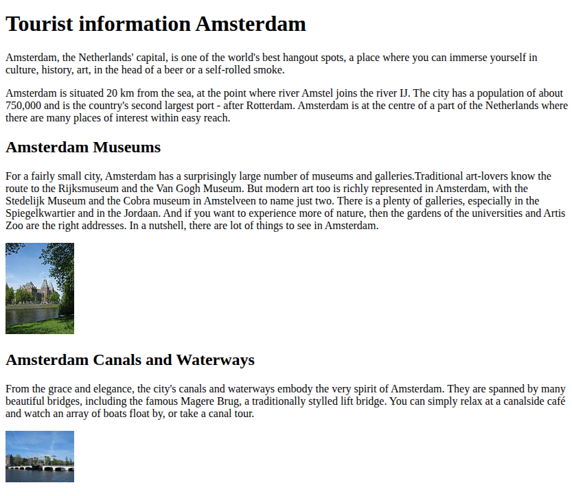
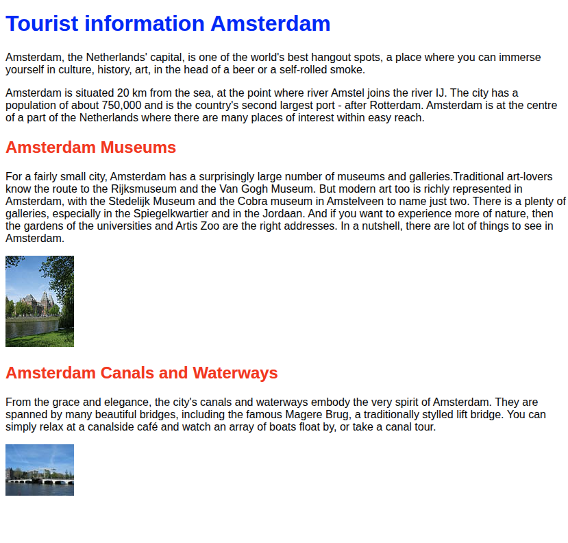
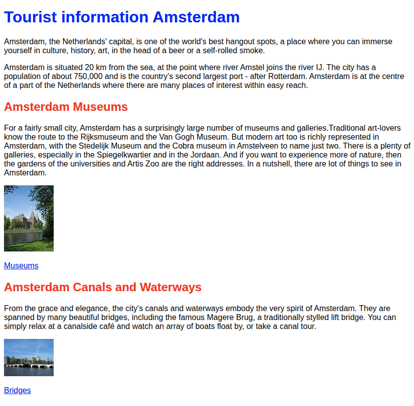
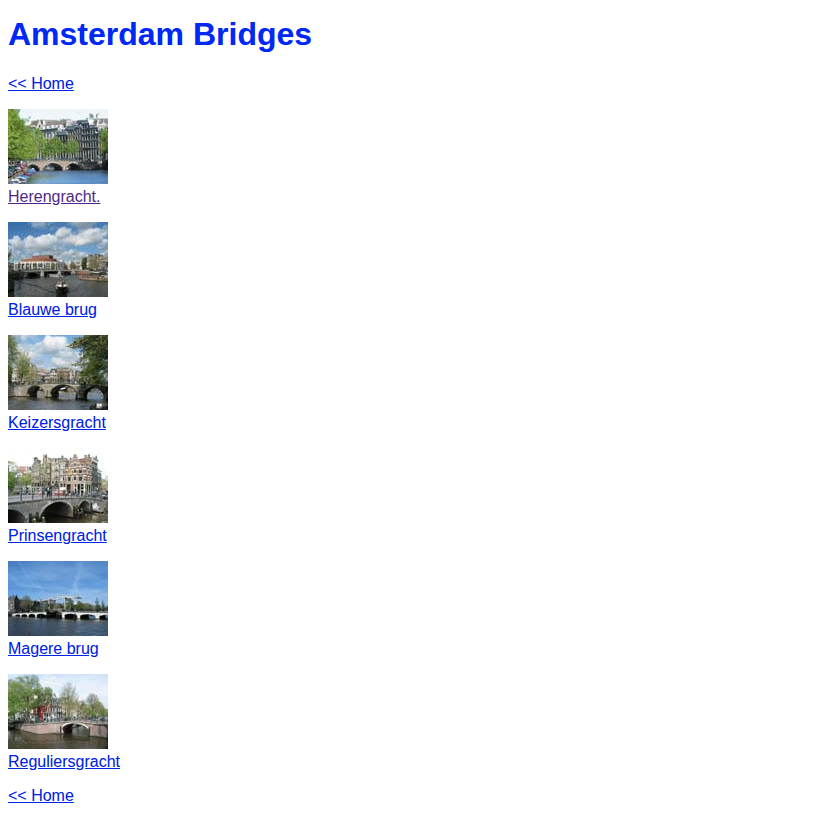
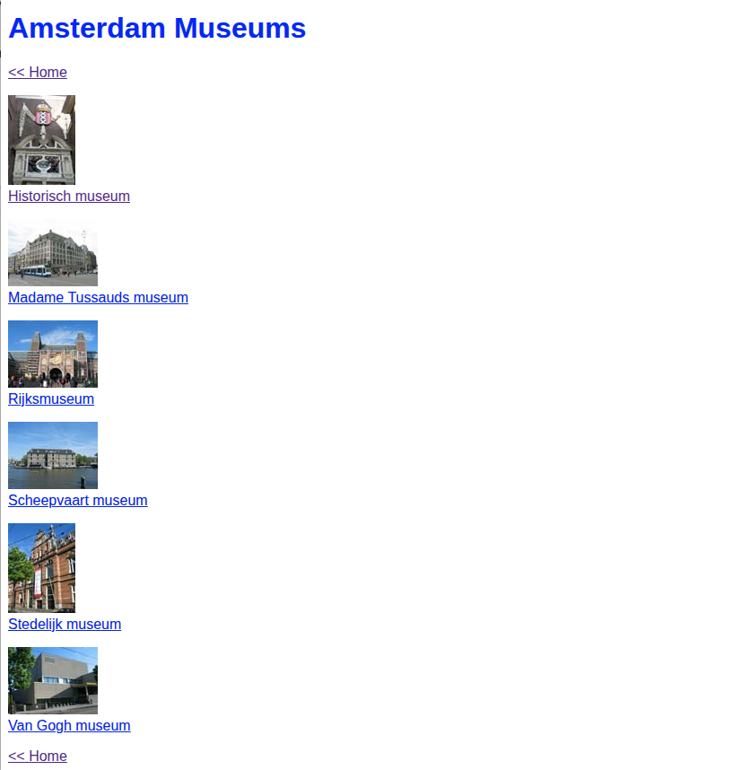

# Assignments week 1

In this file you will find the assignments for week 1. There are two assignments:

1. Create a website for the city of Amsterdam
2. PHP Programming

**Important!**

Place your files in the folder `/Docker/websites/student/week-01`. To view your answers use the following URL-structure:

* http://localhost/student/week-01/assignment-01.html
* http://localhost/student/week-01/assignment-03.php

# HTML and CSS Programming

## Create a website for the city of Amsterdam

### Step 1 - Implement the following

Create the following webpages using the following example(s). Save every version as a different file so that we can
review the changes between versions.

Details

* make sure there is an appropriate titel in the browser's tabpage.
* check your source code with a validator and make sure to solve all warnings and errors
* no need to add styling; this is the next assignment

Your resources, text and images, are available via the ForStudents.zip in the [resources](./resources) folder.

### Step 2 - Improve the page with styling

Improve your first step by adding styling. See the example below.

Details

* add styling by using an external CSS file
    * make the top header blue
    * make level 2 headers red
    * improve fonts by choosing a better font (the example uses `sans-serif`)

### Step 3 - Link to new pages

In this next step we will be adding two new pages:

* one to show all the nice bridges & canals.
* one to show all the museums.

See the example below

* Add links to 2 new pages
    * bridges.html
    * museums.html

Details

* Make sure to use the same styling.
* The images must also be clickable! The must link to the larger image instead of the thumbnail
* make sure to put a navigation back to the home page at the top and at the end of the page (hint: use a footer).

In the [resource folder](./resources) you'll find these larger images.

Here are the two example pages. This first is about the bridges, the seconds contains the example for the museums.

# PHP Programming assignments

In this you will create small webpages using your PHP programming skills.

## Assigment 1: Your profile website

Create a webpage about yourself. Use the following information to introduce yourself:

* Your full name and age
* Your home country and city
* Your hobby
* your siblings

Requirements

* Setup the page using PHP and basic HTML structure using `<article>` and `<section>`.
* Make sure this HTML page uses variables for
    * age
    * city
    * home country
    * hobby
    * Link to your social media profile (LinkedIn, Snapchat etc)
* Calculate your age using the `Date('Y')` function call; subtract your year of birth of the current year (this might
  cause a
  small fault which is not a problem for now)
* Use a proper descriptive text for your social media link. So you'll need a URL and a text to show (e.g. LinkedIn)

For instance this could be the result:

> My name is Martin Molema. I live in Meppel in the Netherlands. I am currrently 55 years of age. My hobby is playing
> the piano.
> You can find me on {img}LinkedIn.

The "LinkedIn" should be clickable and lead to your (or an imaginary) social media website. The social website must be
prefixed by a logo of the site. E.g. [LinkedIn official logo](https://brand.linkedin.com/downloads).

## Assignment 2:Improve your profile!

Improve your profile page and add information about your siblings.

Requirements

* Make sure this HTML page uses variables for `siblings`.
* Use conditional statements to determine how to properly display your siblings (see examples below).

For instance this could be the result:

> My name is Martin Molema. I live in Meppel in the Netherlands. I am currrently 55 years of age. My hobby is playing
> the piano. I have 1 brother and 1 sister.

However, when no siblings are present this should be the text:

> My name is Angelo. I live in Brussels in Belgium. I am currently 21 years of age. My hobby is watching soccer. I have
> no brother and 2 sisters.

Or

> My name is Angelo. I live in Brussels in Belgium. I am currently 21 years of age. My hobby is watching soccer. I have
> no siblings.

### Assignment 3: Improve your profile some more

In this step you will be adding a list of some of your countries favorite dishes / food.

Details

* Use a new `<section>` to setup your list of foods
* supply a header (level 1)
* Use a PHP array to setup the list of food / dishses
* use a `foreach` to print the foods
* use an unordered HTML list (<ul>) and list items.
* make sure to apply some styling to the list!

Pick one of the foods as your favorite food/dish. Use an index in the PHP Array to pick one. Make sure you highlight it
in the HTML list. Use CSS to style this entry from an external CSS file.

