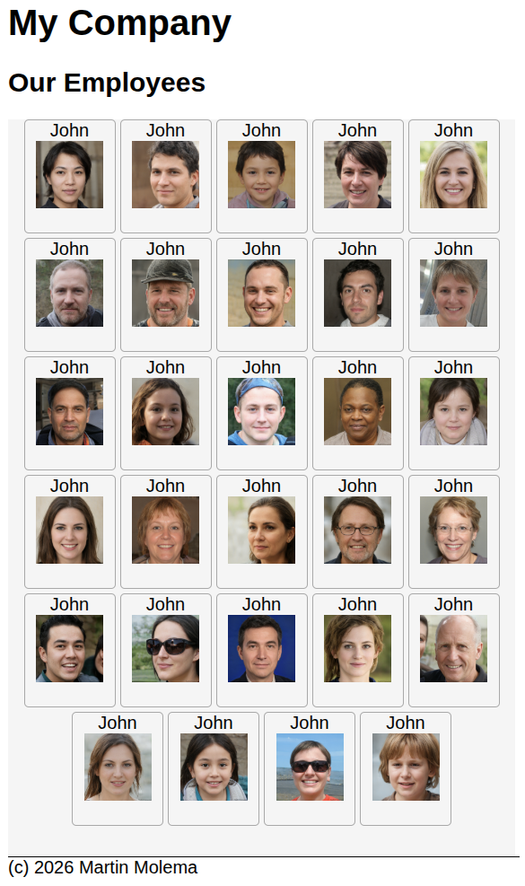
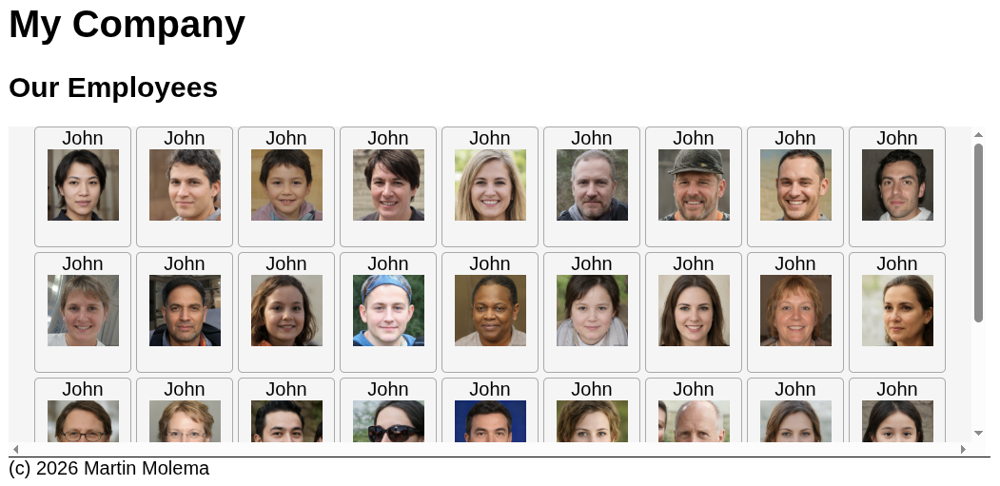

# Opdrachten week 2

Hier vind je

# HTML- en CSS-opdrachten

## Opdracht 1

Bekijk de twee onderstaande websites. Ga ernaartoe en maak alle oefeningen. Dit zal je vaardigheden met de
flexbox en het raster aanzienlijk verbeteren.

* [CSS Grid Garden](https://cssgridgarden.com/)
* [CSS Flex Froggy](https://flexboxfroggy.com/)

## Opdracht 2: maak een schilderij in de stijl van Mondriaan na in HTML

Nu je veel ervaring hebt opgedaan met het gebruik van `display:grid`, kun je aan de volgende oefening beginnen.

Maak het volgende „schilderij“ op een website met behulp van `display:grid`. Het „schilderij“ bestaat uit rode/blauwe/witte/gele
vierkanten. De roze rand geldt als de lijst van het schilderij.

Vereisten:

* gebruik een `display:grid`
* werk niet met vaste afmetingen zoals `10px` voor de vormen van het schilderij.
* gebruik slechts één container (bijv. `section`) als bovenliggend element voor alle vormen van het schilderij.

Informatie over deze opdracht:

* De achtergrondkleur rondom de afbeelding is `hotpink`.
* De `hotpink`-rand is 20px breed/hoog.
* Het totale oppervlak is 600x600 pixels.
* Deze zwarte lijnen zijn 3px dik.

## Opdracht 3: Maak je eigen Facebook

Bekijk de twee afbeeldingen hieronder. Dit is een Facebook-overzicht van alle medewerkers in je virtuele bedrijf. Het overzicht
moet alle medewerkers weergeven op ‘kaarten’, gescheiden door een kleine ‘spatie’. Er moeten zoveel mogelijk personen op een ‘rij’ staan.

Afbeeldingen: met dank aan [Deze persoon bestaat niet](https://thispersondoesnotexist.com/). Bekijk de map
`/assignments/avatars` voor alle afbeeldingen. 

Als de pagina groter is dan de ruimte in de browser, moet er een verticale schuifbalk worden toegevoegd. Bekijk het voorbeeld eens.

Dit kan worden gedaan met behulp van de instructie `overflow: auto` op de container. 

**Opdracht**

* Maak deze pagina aan de hand van de lijst met afbeeldingen.
* vereisten
  * gebruik `display:flex`
  * de afmetingen van de kaarten zijn 80x100 pixels
  * Gebruik de kopteksten H1 en H2 voor de bovenste kopjes ‘Mijn bedrijf’ en ‘Onze medewerkers’
  * De namen doen er niet toe en mogen naar eigen inzicht worden gekopieerd of vervangen.
  * Boven de voettekst moet een zwarte lijn staan.
  * Gebruik de echte HTML-entiteit voor copyright in plaats van (c)

Tips:
* Gebruik de eenheden `vh` en `vw` in combinatie met `height` en `width` met behulp van een `calc()`-functie in CSS.

Als het je gelukt is om de pagina te maken, ga dan experimenteren met waarden voor `justify-content` en `align-items` 

# PHP-programmeeropdrachten - Voorwaardelijke constructies

# Opdracht 1: Rekenopgaven met datums

Maak een variabele met de naam `date` en sla het volgende getal op: 14062016. Dit getal staat voor 14 juni 2016.

Gebruik de operatoren modulo (%) en deling (/), en uitsluitend deze operatoren, om de dag, maand en het jaar in afzonderlijke
variabelen te extraheren. Je antwoord moet werken voor alle mogelijke waarden van de variabele ‘date’.

## Opdracht 2: Programmeren met voorwaardelijke constructies

Implementeer de volgende beslissingstabel met behulp van PHP in combinatie met HTML. Definieer een variabele en stel deze in op een waarde
tussen nul en 20. Gebruik PHP-voorwaardelijke constructies om het 'Resultaat' te bepalen.

Implementeer deze beslissingstabel met behulp van drie soorten PHP-voorwaardelijke constructies:

1. IF-THEN
2. SWITCH
3. MATCH

| Cijfer   | Resultaat |
|---------|------------------|
| < 1     | "Ongeldig getal" |  
| 1, 2, 3 | "Zeer slecht" | 
| 4, 5    | "Onvoldoende"   |
| 6, 7    | "Voldoende"     | 
| 8 | "Goed" |
| 9 | "Zeer goed" | 
| 10 | "Uitstekend" |
| \> 10   | "Ongeldig getal" |   

# Referenties

* [PHP if/then/else](https://www.php.net/manual/en/control-structures.elseif.php)
* [PHP switch](https://www.php.net/manual/en/control-structures.switch.php)
* [PHP match](https://www.php.net/manual/en/control-structures.match.php)

