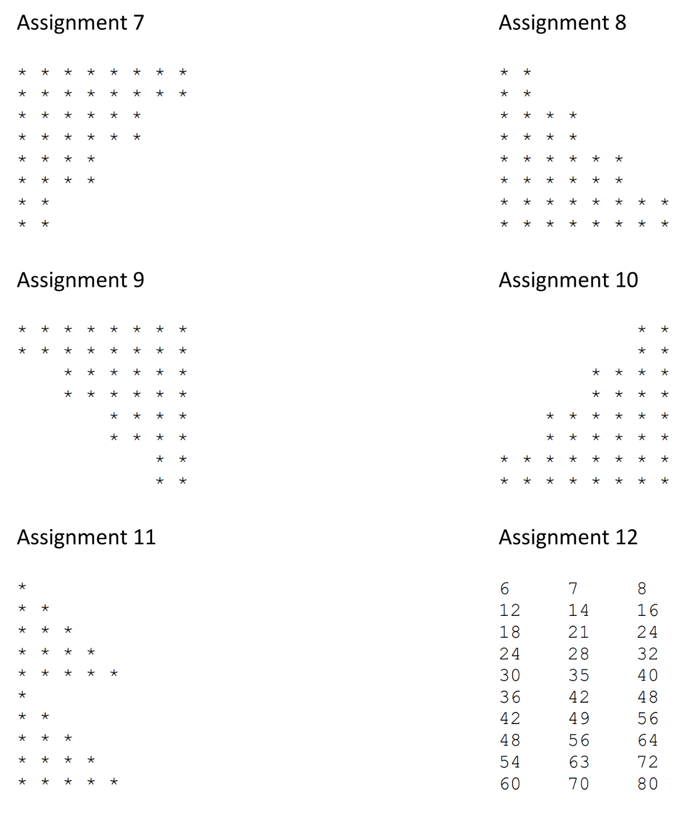
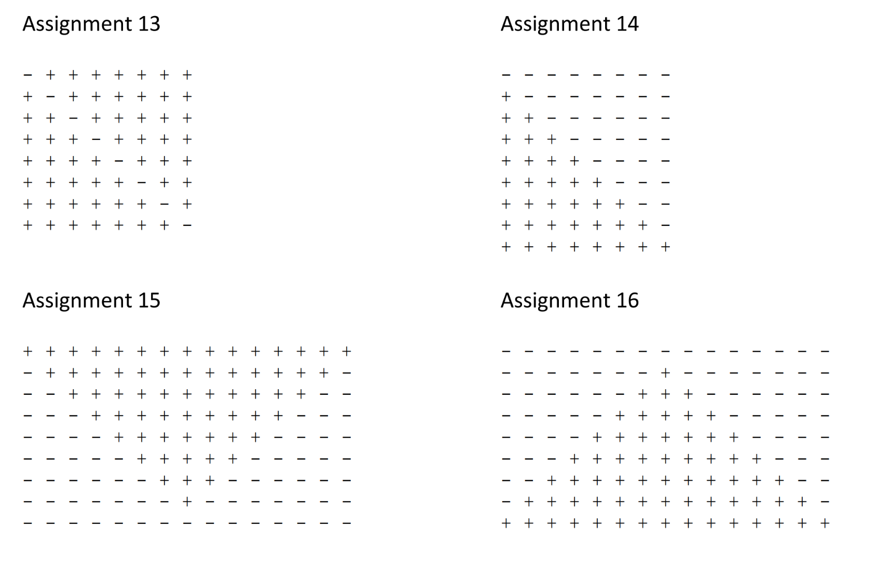
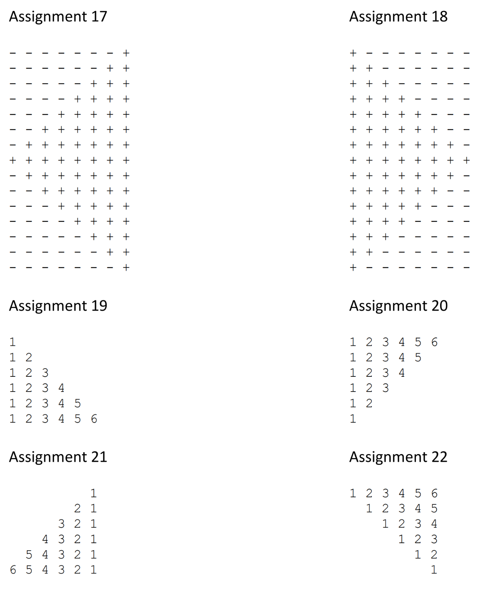
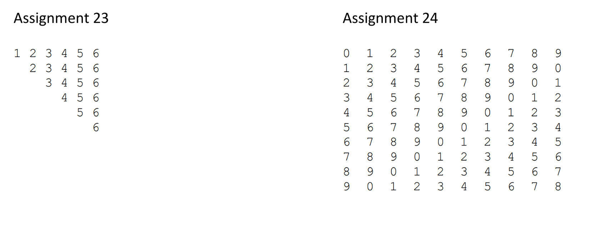

# Week 4 - assignments

Assignment week 4 · Grid Design, Arrays and Loops

This week we are going to practice using grids again. This time with a more complex design that needs to be realized.
Next, we will practice creating and manipulating arrays, a standard tool that is used for this is a 'loop'. This week
there is an 'advanced' version for some exercises. These only need to be made when there is an interest in them.

# HTML and CSS

## Assignment 1 - Build a website

Implement the following

Look at the illustration of below. Realize this website with the help of a grid (and a flexbox where possible). Take
your time with this, there are many details that make the final realized product very interesting.

You should realize this in such a way that a mobile version will also be correctly viewable.

Normal view:


Possible mobile view:


Here are the instructions:

Width, Height, and Placement: No details are provided regarding the width, height, or placement of the web page. Do your
best to mimic the image. If it doesn't work, a total width of 1440px may be used.

Color: The following colors are included with the hsl to make them with using CSS. If you don't know how to use hsl to
give colors, visit Then this page: https://developer.mozilla.org/en-US/docs/Web/CSS/color_value/hsl

* Purple 100 – hsl (254, 88%, 90%)
* Purple 500 – hsl (256, 67%, 59%)
* Yellow 100 – hsl (31, 66%, 93%)
* Yellow 500 – hsl (39, 100%, 71%)
* White – hsl (0, 0%, 100%)
* Black – hsl (0, 0%, 7%)

Fonts: The default font size is 18px. Set the font size to the <body> using CSS. The following information is provided.

* Font family: DM-Sans; font-weights: 400, 500.

Use the following line in your HTML (in the <head>) to add this new font:

```html

<link rel="preconnect" href="https://fonts.googleapis.com">
<link rel="preconnect" href="https://fonts.gstatic.com" crossorigin>
<link href="https://fonts.googleapis.com/css2?family=DM+Sans:ital,opsz,wght@0,9..40,100..1000;1,9..40,100..1000&display=swap"
      rel="stylesheet"> 
```

Then, use the following css rule to apply DM Sans:

```css

font-family:

"DM Sans"
;
sans-serif font-optical-sizing: auto

;
font-style: normal

;
```

The `font-weight` you can choose yourself.

**Resources**

See the `resources/week-04` folder for the images and fonts you need. Almost all images are of the new WEBP format,
these can be used in the same way as 'standard' images.

# PHP Programming - Functions

## Assignment 1 - Colorwheel

When using CSS there are various ways to assign colors for e.g. text and background. One of these is the HSL color. The
letters are Hue - Saturation - Lightness. This colorschema can be imagened as being circular, like wrapped around a
barrel.

### Step 1 - create HSL function

Create a function that will create a color based upon the three parameters H,S and L to create a HSL color. Make sure
that the parameters are within range of the HSL-values. If a parameter is wrong just return `hsl(0 0 0)`.

* Hue is an *angle* between zero and 360 degrees.
* Saturation is a percentage between zero and 100%.
* Lightness is also a percentage between zero and 100%.

Use it to assign it to an element as a background:

```html

<article style="background-color:hsl(10 20 30)">some text</article>

```

Try values:

* hue : 20
* saturation: 50
* lightness: 80

Note that this is in fact bad practice, but it will be used in the next step to actually create a strip of colors.

### Use a loop

Use a loop of your liking to make 360 elements. Each block should get a new color using the function.

Create a function with two parameters:

* Saturation
* Lightness

The loop must vary the *Hue* from zero to 360. You can experiment with the parameters you want to vary and create a
strip like the image below.


Put the loop creating the elements in a function and call it from HTML.

Hints:

* use `<div>` elements in combination with `display:flex` on the parent to place them next to each other to create a
  horizontal strip.
* have a look at `flex-wrap`
* do not echo from the function but `return` a string you build, otherwise the next assignments will get increasingly
  difficult!

### Use another loop!

Now that we can vary the color with the second function we can create multiple strips to create a large area.

Create another function that will call the second function with varying saturation. So the last function has a loop that
will vary the saturation from zero to 100% and calls the second function.

This third function only has one parameter for *lightness*.

The result should look something like the images below:

Lightness 80%:


Lightness 50%:


### Add text and reverse the wheel

In this last assignment with the HSL-colors you will place text on top of the reversed color wheel.

* Add a lot of text (using Emmet and Lorem Ipsum, see references at the end)
* Reverse the lightness: start at 100% and decrease to zero
* Use absolute positioning to place the color are and text on top each other
* Restrict the width of the text so it will approximately fit the text using `em` as a width unit.

Hints

* add a container for both parts (text and color area)
* make proper use of `position:relative` and `position:absolute` for the container and its children
* have a look at the lesson of last week about positioning!

The result should look something like this:


## Assignment 2 - Areacodes

### Task 2a

Create an array called 'areacodes' and place the following numbers in this exact sequence in the array: 14, 26,
12, 58, 34, 66, 7, and 41. Write a function that looks up the highest number in the array and displays it on the screen.

### Task 2b

Create a function that can search for a number within this array, when found it gives a `success!` message that
also contains the number found. Also, give it a `fail!` message when the number is not found.

### Task 2c

Advanced: Rewrite the search function of Task 2b, but expands the function with the ability to search for
multiple numbers. Give a comprehensive success and fail message when applicable. The success message must include how
many times the number you are looking for has been found in the array.

# Assignment 3 - Creating shapes.

Task 3a: Build the following 'shapes' using loops and echoes. An echo may contain only a single asterisk (*). Make use
of `<br>` or '\n' when needed. Violating the `<br>` within a `<p></p>` rule is permitted.


## Task 3b

Choose at least 3 shapes from the list below to recreate. Use functions and smart parameters to create these shapes.










# Task 4

Create a function that represents the fibonacci sequence, with commas between the numbers. This function accepts a
single parameter called 'count'. Parameter count is used to determine how many numbers of the fibonacci sequence are
displayed.

This is the start of the sequence:

```text
0, 1, 1, 2, 3, 5, 8, 13, 21, 34,....
```

The rules are this:

* when x equals 0, return zero
* when x equals 1, return 1
* otherwise, return the sum of the two previous outcomes

Create a function that takes one integer parameter that must be greater than or equal to zero, and returns an array
containing all the Fibonacci number up and until that number. Use the `join()` function to convert it to a string after
calling the function and present it in a small HTML body using `<pre>` and `<code>`.

The Fibonacci sequence can be visualised as the image below. Each square has a sides the length of the sum of the two
previous shapes. So, fibonacci (6) equals 5, so the fourth square has sides with length 5. A curve can be drawn through
each area from the incoming corner to the one opposite. As the line extends outward, the ratio between the sizes of the
consecutive squares approaches the *Golden Ratio* (≈ 1.618).


# References

* [Generate placeholder text using Emmet](https://www.jetbrains.com/guide/tips/add-lorem-ipsum/)