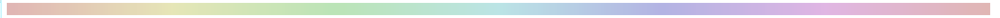
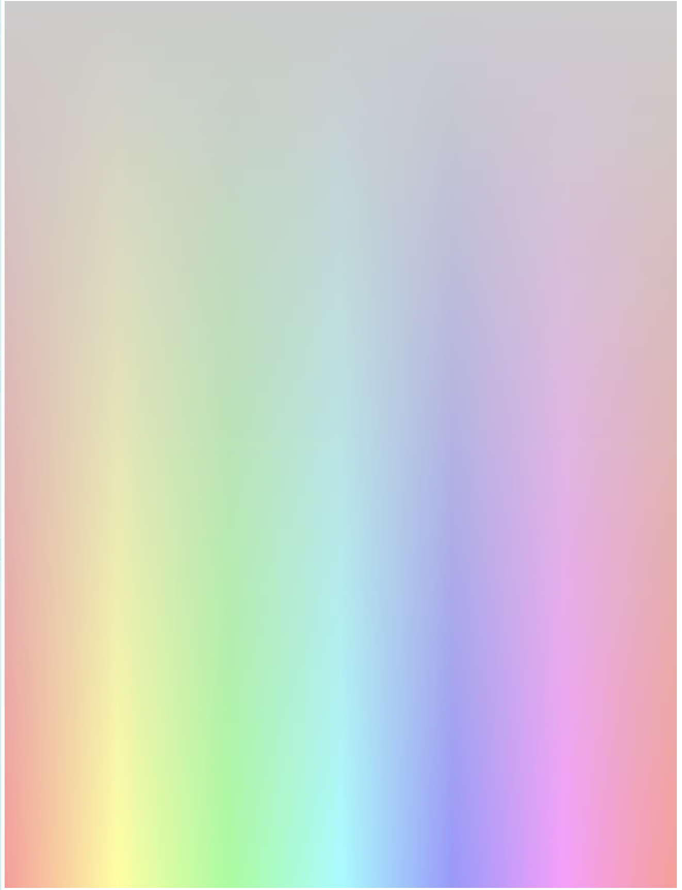
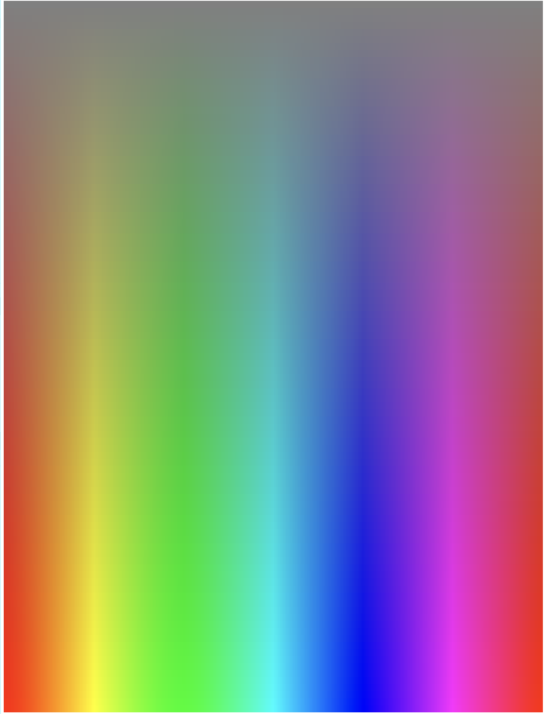
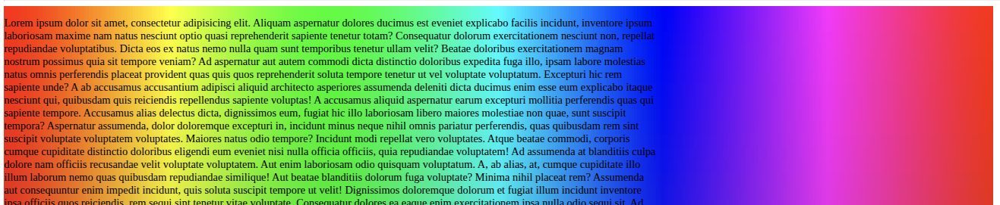
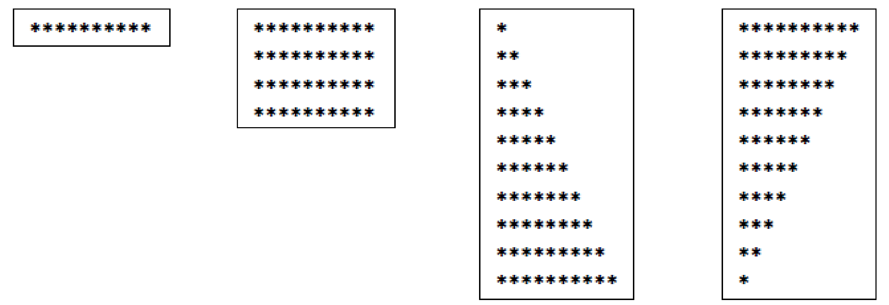
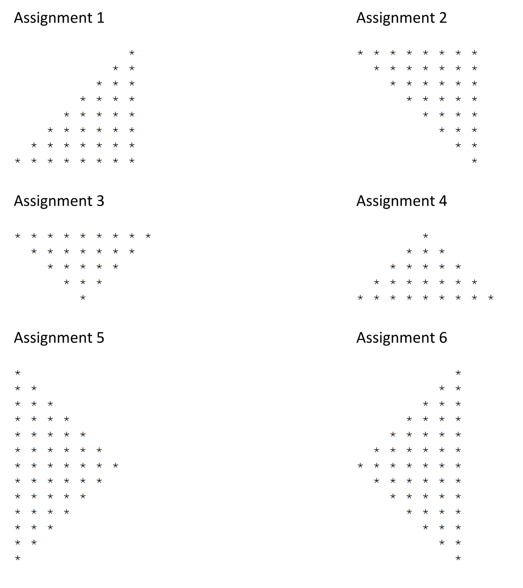
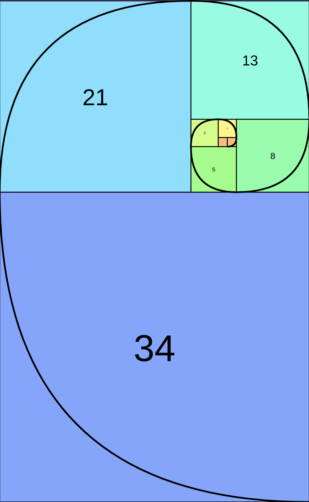

# Week 4 - opdrachten

Opdracht week 4 · Rasterontwerp, arrays en lussen

Deze week gaan we weer oefenen met het gebruik van rasters. Deze keer met een complexer ontwerp dat moet worden gerealiseerd.
Vervolgens gaan we oefenen met het maken en bewerken van arrays; een standaard hulpmiddel dat hiervoor wordt gebruikt is een ‘lus’. Deze week
is er voor sommige oefeningen een ‘gevorderde’ versie. Deze hoeven alleen te worden gemaakt als je daar interesse in hebt.

# HTML en CSS

## Opdracht 1 - Bouw een website

Implementeer het volgende

Bekijk de onderstaande afbeelding. Realiseer deze website met behulp van een raster (en waar mogelijk een flexbox). Neem
hier de tijd voor; er zijn veel details die het uiteindelijke resultaat erg interessant maken.

Zorg ervoor dat de website ook op mobiele apparaten correct wordt weergegeven.

Normale weergave:


Mogelijke mobiele weergave:


Hier zijn de instructies:

Breedte, hoogte en plaatsing: Er worden geen details gegeven over de breedte, hoogte of plaatsing van de webpagina. Doe je
best om de afbeelding zo goed mogelijk na te bootsen. Als dat niet lukt, mag een totale breedte van 1440px worden gebruikt.

Kleur: De volgende kleuren zijn in HSL-notatie weergegeven, zodat je ze met CSS kunt realiseren. Als je niet weet hoe je HSL moet gebruiken om
kleuren op te geven, ga dan naar deze pagina: https://developer.mozilla.org/en-US/docs/Web/CSS/color_value/hsl

* Paars 100 – hsl (254, 88%, 90%)
* Paars 500 – hsl (256, 67%, 59%)
* Geel 100 – hsl (31, 66%, 93%)
* Geel 500 – hsl (39, 100%, 71%)
* Wit – hsl (0, 0%, 100%)
* Zwart – hsl (0, 0%, 7%)

Lettertypen: De standaard lettergrootte is 18px. Stel de lettergrootte in via <body> met behulp van CSS. De volgende informatie wordt verstrekt.

* Lettertypefamilie: DM-Sans; lettergewichten: 400, 500.

Gebruik de volgende regel in je HTML (in de <head>) om dit nieuwe lettertype toe te voegen:

```html

<link rel="preconnect" href="https://fonts.googleapis.com">
<link rel="preconnect" href="https://fonts.gstatic.com" crossorigin>
<link href="https://fonts.googleapis.com/css2?family=DM+Sans:ital,opsz,wght@0,9..40,100..1000;1,9..40,100..1000&display=swap"
      rel="stylesheet"> 
```

Gebruik vervolgens de volgende CSS-regel om DM Sans toe te passen:

```css

font-family:

"DM Sans"
;
sans-serif font-optical-sizing: auto

;
font-style: normal

;
```

De `font-weight` kun je zelf kiezen.

**Bronnen**

Kijk in de map `resources/week-04` voor de afbeeldingen en lettertypen die je nodig hebt. Bijna alle afbeeldingen zijn in het nieuwe WEBP-formaat;
deze kunnen op dezelfde manier worden gebruikt als ‘standaard’ afbeeldingen.

# PHP-programmeren - Functies

## Opdracht 1 - Kleurenwiel

Bij het gebruik van CSS zijn er verschillende manieren om kleuren toe te wijzen aan bijvoorbeeld tekst en achtergrond. Een daarvan is de HSL-kleur. De
letters staan voor Hue (tint) - Saturation (verzadiging) - Lightness (helderheid). Dit kleurenschema kun je je voorstellen als een cirkel, alsof het om een
vat is gewikkeld.

### Stap 1 - HSL-functie maken

Maak een functie die een kleur genereert op basis van de drie parameters H, S en L om een HSL-kleur te creëren. Zorg ervoor
dat de parameters binnen het bereik van de HSL-waarden vallen. Als een parameter onjuist is, retourneer dan gewoon `hsl(0 0 0)`.

* Tint is een *hoek* tussen nul en 360 graden.
* Verzadiging is een percentage tussen nul en 100%.
* Helderheid is ook een percentage tussen nul en 100%.

Gebruik deze functie om een kleur als achtergrond aan een element toe te wijzen:

```html

<article style="background-color:hsl(10 20 30)">some text</article>

```

Probeer de volgende waarden:

* tint: 20
* verzadiging: 50
* helderheid: 80

Let op: dit is in feite geen goede werkwijze, maar het wordt in de volgende stap gebruikt om daadwerkelijk een kleurenstrook te maken.

### Gebruik een lus

Gebruik een lus naar keuze om 360 elementen te maken. Elk blok moet met behulp van de functie een nieuwe kleur krijgen.

Maak een functie met twee parameters:

* Verzadiging
* Helderheid

De lus moet de *Tint* variëren van nul tot 360. Je kunt experimenteren met de parameters die je wilt variëren en een
strook maken zoals in de afbeelding hieronder.



Plaats de lus die de elementen aanmaakt in een functie en roep deze op vanuit HTML.

Tips:

* gebruik `<div>`-elementen in combinatie met `display:flex` op het bovenliggende element om ze naast elkaar te plaatsen en zo een
  horizontale strook te maken.
* kijk eens naar `flex-wrap`
* gebruik geen echo vanuit de functie, maar `return` een string die je zelf samenstelt, anders worden de volgende opdrachten steeds
  moeilijker!

### Gebruik nog een lus!

Nu we de kleur kunnen variëren met de tweede functie, kunnen we meerdere stroken maken om een groot vlak te creëren.

Maak nog een functie die de tweede functie aanroept met variërende verzadiging. De laatste functie bevat dus een lus die
de verzadiging varieert van nul tot 100% en de tweede functie aanroept.

Deze derde functie heeft slechts één parameter voor *lichtheid*.

Het resultaat zou er ongeveer zo uit moeten zien als op de onderstaande afbeeldingen:

Lichtheid 80%:



Helderheid 50%:



### Voeg tekst toe en keer het kleurenwiel om

In deze laatste opdracht met de HSL-kleuren plaats je tekst bovenop het omgekeerde kleurenwiel.

* Voeg veel tekst toe (met behulp van Emmet en Lorem Ipsum, zie referenties aan het einde)
* Keer de helderheid om: begin bij 100% en verlaag naar nul
* Gebruik absolute positionering om het kleurgebied en de tekst over elkaar heen te plaatsen
* Beperk de breedte van de tekst zodat deze ongeveer past, met `em` als breedte-eenheid.

Tips

* voeg een container toe voor beide onderdelen (tekst en kleurgebied)
* maak goed gebruik van `position:relative` en `position:absolute` voor de container en de onderliggende elementen
* bekijk de les van vorige week over positionering!

Het resultaat zou er ongeveer zo uit moeten zien:


## Opdracht 2 - Areacodes

### Taak 2a

Maak een array met de naam 'areacodes' en plaats de volgende getallen in precies deze volgorde in de array: 14, 26,
12, 58, 34, 66, 7 en 41. Schrijf een functie die het hoogste getal in de array opzoekt en dit op het scherm weergeeft.

### Opdracht 2b

Maak een functie die in deze array naar een getal kan zoeken; wanneer het wordt gevonden, geeft de functie een `success!`-melding weer die
ook het gevonden getal bevat. Geef bovendien een `fail!`-melding wanneer het getal niet wordt gevonden.

### Opdracht 2c

Gevorderd: Herschrijf de zoekfunctie uit Opdracht 2b, maar breid de functie uit met de mogelijkheid om naar
meerdere getallen te zoeken. Geef indien van toepassing een uitgebreide succes- en foutmelding. De succesmelding moet vermelden hoe
vaak het gezochte getal in de array is gevonden.

# Opdracht 3 - Vormen maken.

Opdracht 3a: Maak de volgende ‘vormen’ met behulp van lussen en echo’s. Een echo mag slechts één sterretje (*) bevatten. Maak gebruik
van `<br>` of ‘\n’ indien nodig. Het overtreden van de regel `<br>` binnen een `<p></p>` is toegestaan.



## Opdracht 3b

Kies ten minste 3 vormen uit de onderstaande lijst om na te maken. Gebruik functies en slimme parameters om deze vormen te maken.




# Opdracht 4

Maak een functie die de Fibonacci-reeks weergeeft, met komma's tussen de getallen. Deze functie accepteert één
parameter, genaamd ‘count’. De parameter ‘count’ wordt gebruikt om te bepalen hoeveel getallen van de Fibonacci-reeks worden
weergegeven.

Dit is het begin van de reeks:

```text
0, 1, 1, 2, 3, 5, 8, 13, 21, 34,....
```

De regels zijn als volgt:

* als x gelijk is aan 0, geef dan nul terug
* als x gelijk is aan 1, geef dan 1 terug
* anders geef je de som van de twee voorgaande uitkomsten terug

Maak een functie die één geheelgetal als parameter ontvangt (dat groter dan of gelijk aan nul moet zijn) en een array teruggeeft
die alle Fibonacci-getallen tot en met dat getal bevat. Gebruik de functie `join()` om deze na het
aanroepen van de functie om te zetten in een tekenreeks en presenteer deze in een kleine HTML-body met behulp van `<pre>` en `<code>`.

De Fibonacci-reeks kan worden gevisualiseerd zoals in de afbeelding hieronder. Elk vierkant heeft zijden met een lengte die gelijk is aan de som van de twee
voorgaande vierkanten. Fibonacci (6) is dus gelijk aan 5, waardoor het vierde vierkant zijden heeft met een lengte van 5. Er kan een curve worden getrokken door
elk gebied, van de ene hoek naar de tegenoverliggende hoek. Naarmate de lijn zich naar buiten uitstrekt, benadert de verhouding tussen de afmetingen van de
opeenvolgende vierkanten de *Gulden Snede* (≈ 1,618).



# Bronnen

* [Placeholdertekst genereren met Emmet](https://www.jetbrains.com/guide/tips/add-lorem-ipsum/)