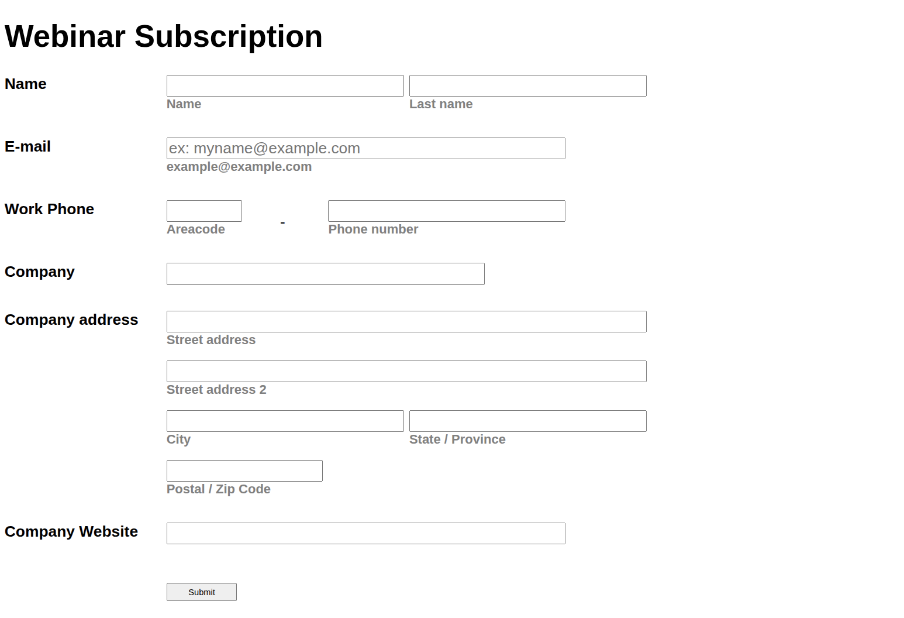

# Opdrachten week 5 - Formulieren en het verwerken van formuliergegevens

Week 5 gaat over het maken van formulieren en het verwerken van ingevoerde gegevens. De volgende opdrachten hebben betrekking op het
formulier zoals hieronder weergegeven.

## HTML - maak een formulier

Bekijk de afbeelding hierboven. Maak dit formulier in een nieuw bestand. Probeer het ontwerp zo goed mogelijk na te bootsen.

Hier zijn de instructies:

* Breedte, hoogte en plaatsing: Er worden geen details gegeven over de breedte, hoogte of plaatsing van de webpagina. Doe
  je best om de afbeelding zo goed mogelijk na te bootsen.
* Kleur: Er worden geen specifieke kleuren opgegeven. De achtergrond mag elke variant van de kleur ‘grijs’ zijn.
* Lettertypen: De standaardlettergrootte is 18px. Stel de lettergrootte in op `<body>` met behulp van CSS.

### Opdracht 1a

Maak het formulier zoals afgebeeld. Gebruik waar van toepassing de juiste `<input>`-varianten.

### Opdracht 1b

Voeg een selectievakje en een keuzerondje toe. Zorg ervoor dat de opties qua stijl en
doel bij de rest van het formulier passen.

### Opdracht 1c

Maak een eenvoudige validatie van het formulier. Voorlopig is de enige validatie dat geen enkele optie leeg mag zijn. Gebruik de
filter_input- en empty-functies die beschikbaar zijn in PHP.

### Opdracht 1d

Wanneer de gebruiker het formulier verstuurt en alle ‘validaties’ zijn geslaagd, geef dan de ingevoerde gegevens weer in een geldige, gestileerde HTML-opmaak.
Geldige uitvoer moet een groene kleur hebben. Wanneer de gebruiker het formulier verstuurt en er fouten zijn, toon dan alle fouten in één keer.
Fouten hebben een rode kleur.

## Opdracht 2: Pas je validatie aan zodat je de volgende opties kunt valideren:

* De naam (zowel voor- als achternaam) moet minimaal 5 tekens lang zijn en ten minste 1 hoofdletter bevatten.
* Het e-mailadres moet geldig zijn. Geldig betekent in dit geval dat het een @-teken bevat en eindigt op .eu

Straatadresregel 1 mag niet leeg zijn, maar straatadresregel 2 mag wel leeg zijn. Als bij het verzenden straatadresregel
2 leeg is, moet het adres van de school worden weergegeven als uitvoer voor straatadresregel 2.

## Opdracht 3 – geavanceerde  browservalidatie met behulp van reguliere expressies

Terwijl de gebruiker typt, moet de rand van het huidige invoerveld van kleur veranderen op basis van de hierboven ingestelde validatieregels.
Telkens wanneer de invoer verandert, moet de inhoud van het invoerveld worden gecontroleerd aan de hand van de validatieregels en moet de
rand veranderen naargelang de inhoud geldig of ongeldig is. Groen voor geldig, rood voor ongeldig.

Breid de validatie uit zodat alleen geldige e-mailadressen (echte e-mailadressen), geldige postcodes (alleen Nederlandse) en geldige telefoonnummers
(mobiele nummers en nummers uit Nederland) worden toegestaan.  