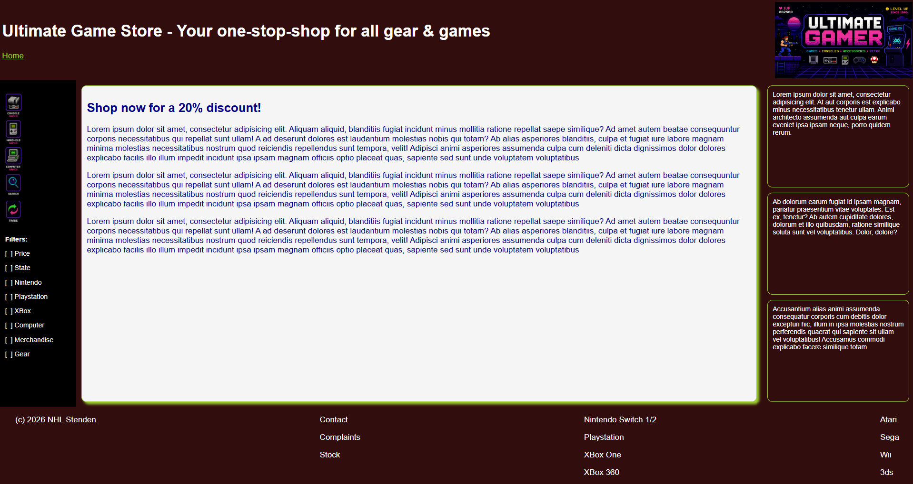
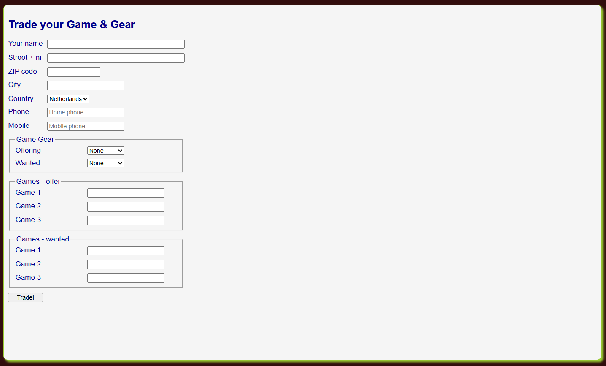
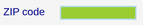

# Week 6 - printing

Recreate the website below. This is an eighties style website to trade your gaming gear and games. The styling contains
8 bit graphics, a bold, screaming logo and black/green-yellow colors.

This is not a site that is very printer friendly. So, your challenge is to make it so that the user can enjoy a hardcopy
or PDF file.

Furthermore, the form to trade your gear or games must be validated properly.

## Functional requirements

### General

- mobile friendly for smaller screens
- printer friendly: only the contents part should appear on the printout without all kinds of clutter and useless styling.

### ads

- when the screen becomes too small, remove the ads from the trade form.

### navigation

    - when hovering above the image-buttons, create some funny transformation on the image (use CSS `transform`)
    - the text behind the filters may not wrap if the space becomes too small; take measures using the grid-columns and
      white space wrapping

### footer

The footer should contain fake links to more (non-existing) pages. As often seen in websites the footer is then divided
into sections holding a themed set of links. When the space for the footer decreases these sections are less
recognizable. Therefore, when the space becomes too small the items must be placed below one another and separated by a
line.

### Form - trading

- default country is "Netherlands"
- Process the form using PHP. The following rules apply
    - the following inputs are mandatory: Name, Street, ZIP, City, Country
    - either home phone or mobile phone must be present
    - either trading of Game or Gear must be filled out
    - when offering game gear, also the 'wanted gear' must be chosen (non empty)

## Style guide

### Main

- main background color: `rgb(50 13 13)` (sort of very dark red)
- font size normal: `12pt`
- font size smaller: `10pt` (filters in left sidebar)
- text color: `white` on main background color
- text in contents section: `darkblue`
- contents section background color: `whitesmoke`

### Form

The trading form should look like the image below:

- when entering text in a input make the background `yellowgreen` and the border `lightblue`. hint: set `outline` to
  `none`.
- use a `display:grid` for automatically layout the `labels`, `inputs` and `fieldset`. Do not use `display:inline-block`
  for labels

### Examples:

Entering text in a form `<input>`. Notice the border and background-color.

## Form - values and processing

- default country is "Netherlands"
- Process the form using PHP. The following rules apply
    - the following inputs are mandatory: Name, Street, ZIP, City, Country
    - either home phone or mobile phone must be present
    - either trading of Game or Gear must be filled out
    - when offering game gear, also the 'wanted gear' must be chosen (non empty)
- make sure the browser checks as much as possible (e.g. format and required)
- even if you make the browser check format and mandatory fields, also check in PHP!
-

## Mobile "responsive" versions

- make sure the left navigation remains completely visible when the screen becomes smaller
- Use breakpoint at 768 pixels and 400 pixels to make sure everything is visible
- take a close look at the ordering of elements in the mobile version!

## Technical requirements

- make one CSS for the main page
- make an extra CSS for the order form; also use the CSS for the main form
- use the images from the `images` folder.
- use grid for the main layout
- create grid-areas to make programming easier
- use flex-box for ordering elements within
- make sure the HTML is valid according to the W3 standards
    - Images have ALT attributes
    - Input and Labels are properly linked
    - proper `h1` / `h2` / `h3` ordering
- use a separate CSS file for printing instructions

## Hints

- First make the complete main page. Then copy the entire page and create the trade form page in the contents-section
- You could use CSS variables (--background: and var (--background)) for consistent styling 
